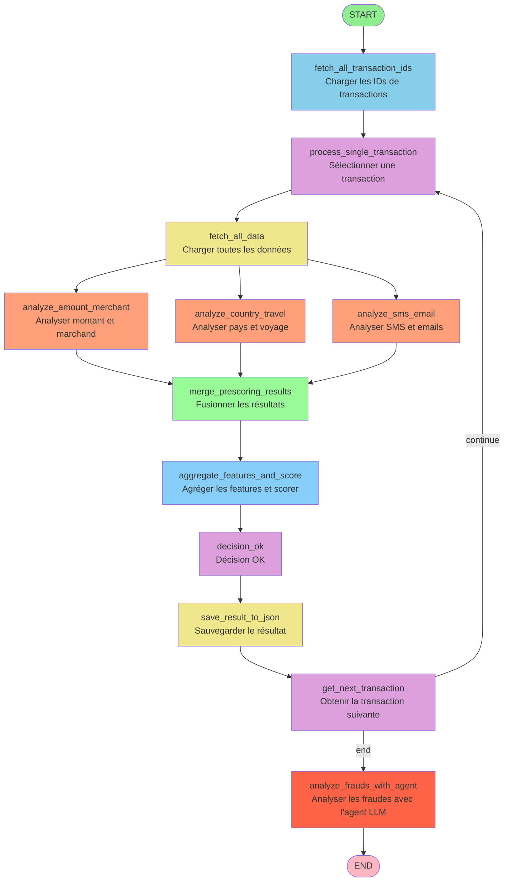

# Diagramme du graphe LangGraph - Détection de fraude

## Description des nœuds

### Phase d'initialisation
- **fetch_all_transaction_ids**: Charge tous les IDs de transactions depuis `fraud.json`
- **process_single_transaction**: Sélectionne une transaction à traiter

### Phase de collecte de données
- **fetch_all_data**: Charge toutes les données nécessaires (transaction, profil utilisateur, SMS, emails, locations)

### Phase d'analyse parallèle (prescoring)
- **analyze_amount_merchant**: Analyse les anomalies de montant et de marchand
- **analyze_country_travel**: Analyse les anomalies de pays et de voyage
- **analyze_sms_email**: Analyse les SMS et emails pour détecter des signaux de phishing

### Phase de fusion et scoring
- **merge_prescoring_results**: Fusionne les résultats des 3 analyses parallèles
- **aggregate_features_and_score**: Agrège toutes les features et calcule un score de risque

### Phase de décision et sauvegarde
- **decision_ok**: Prend une décision basée sur le score
- **save_result_to_json**: Sauvegarde le résultat dans `fraud.json`

### Boucle de traitement
- **get_next_transaction**: Obtient la transaction suivante
  - Si `continue`: Retourne à `process_single_transaction` pour traiter la transaction suivante
  - Si `end`: Passe à l'analyse finale avec l'agent LLM

### Phase d'analyse finale
- **analyze_frauds_with_agent**: Analyse toutes les transactions suspectes avec l'agent LLM (LangGraph) pour confirmation finale

## Flux de données

Le graphe traite les transactions de manière séquentielle dans une boucle :
1. Pour chaque transaction, il collecte les données
2. Effectue 3 analyses en parallèle
3. Fusionne les résultats et calcule un score
4. Sauvegarde le résultat
5. Passe à la transaction suivante
6. Une fois toutes les transactions traitées, lance l'analyse finale avec l'agent LLM
